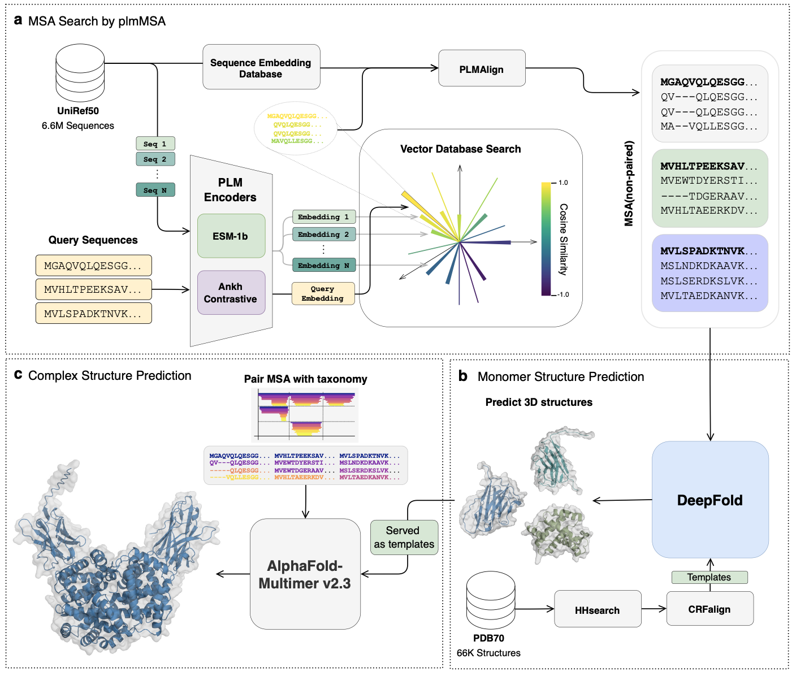

# DeepFold-PLM: Accelerating Protein Structure Prediction via Efficient Homology Search Using Protein Language Models

[](https://github.com/your-repo/DeepFold-PLM)
[](https://df-plm.deepfold.org/)
[](LICENSE)

## 🧬 Overview

DeepFold-PLM accelerates protein structure prediction by integrating advanced protein language models with vector embedding databases to achieve ultra-fast MSA construction and enhanced structure prediction capabilities. 




### Key Features

- **⚡ 47x Faster MSA Generation**: Dramatically accelerated multiple sequence alignment construction
- **🎯 Accurate Predictions**: Maintains prediction accuracy comparable to AlphaFold
- **🔗 Multimeric Complexes**: Extended modeling capabilities for protein complexes
- **🚀 Scalable Implementation**: PyTorch-based framework for large-scale predictions
- **🌐 User-Friendly Interface**: Real-time analysis through web service
- **🔌 API Access**: plmMSA API access with automatic pairing capabilities
- **⏱️ Ultra-Fast Search**: MSA search completion within seconds (when queue is not busy)
- **📈 Enhanced Diversity**: Increased sequence diversity for better coevolutionary information

## 🖥️ Website

Explore now: [https://df-plm.deepfold.org/](https://df-plm.deepfold.org/)

## 🚀 Quick Start

### plmMSA

✨ **Try our fast plmMSA API** - Get MSA results in seconds with automatic pairing support! Fully compatible with ColabFold and MMseqs2 API formats for seamless integration into your existing workflows.

**Easy Integration with ColabFold:**
```python
from colabfold.batch import run

results = run(
    queries=queries,
    result_dir=result_dir,
    use_templates=use_templates,
    ...  # other parameters
    host_url="https://df-plm.deepfold.org/api/colab"
)
```

**Easy Integration with Boltz:**
```bash
boltz predict 8JEL.yaml --use_msa_server --msa_server_url "https://df-plm.deepfold.org/api/colab"
```

**REST API Example:**
```bash
# Submit MSA job for protein complex
curl -X POST 'https://df-plm.deepfold.org/api/plmmsa/v1/submit' \
-H 'Content-Type: application/json' \
-d '{
    "mode": "unpaired+paired", 
    "sequences": [
        "MAHHHHHHVAVDAVSFTLLQDQLQSVLDTLSEREAGVVRLRFGLTDGQPRTLDEIGQVYGVTRERIRQIESKTMSKLRHPSRSQVLRDYLDGSSGSGTPEERLLRAIFGEKA",
        "MRYAFAAEATTCNAFWRNVDMTVTALYEVPLGVCTQDPDRWTTTPDDEAKTLCRACPRRWLCARDAVESAGAEGLWAGVVIPESGRARAFALGQLRSLAERNGYPVRDHRVSAQSA"
    ]
}'

# Check job status (replace YOUR_JOB_ID with actual job ID)
curl -X GET 'https://df-plm.deepfold.org/api/plmmsa/v1/job/YOUR_JOB_ID'
```

See [plmMSA](plmMSA) for more information.

### DeepFold PyTorch

See [DeepFold](https://github.com/DeepFoldProtein/DeepFold/blob/main) for more information.

## 📚 Citation

If you use DeepFold-PLM in your research, please cite our paper:

```bibtex
@article{kim2025deepfold,
  title={DeepFold-PLM: Accelerating Protein Structure Prediction via Efficient Homology Search Using Protein Language Models},
  author={Kim, Minsoo and Bae, Hanjin and Jo, Gyeongpil and Kim, Kunwoo and Lee, Sung Jong and Yoo, Jejoong and Joo, Keehyoung},
  journal={Submitted},
  year={2025},
  url={https://df-plm.deepfold.org/}
}
```

## 📄 License

This project is licensed under the MIT License - see the [LICENSE](LICENSE) file for details.
