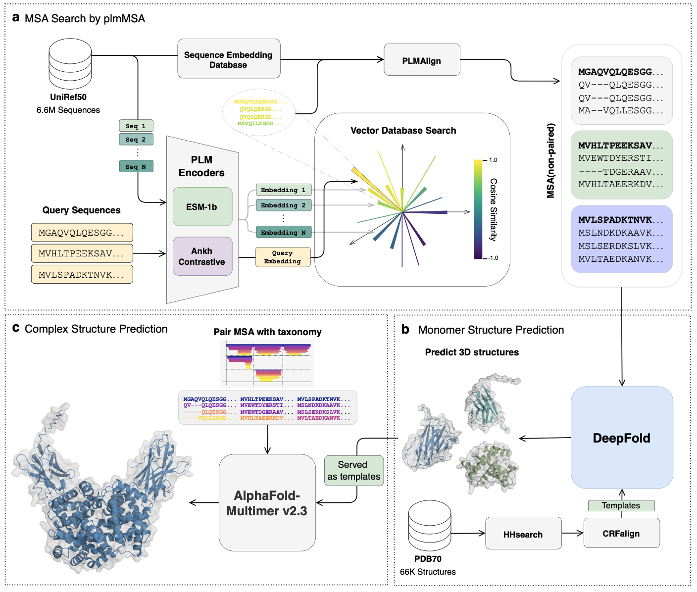
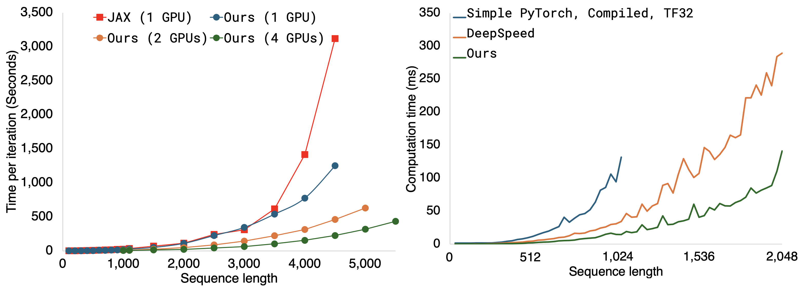

# DeepFold-PLM: Accelerating Protein Structure Prediction via Efficient Homology Search Using Protein Language Models

[](https://github.com/your-repo/DeepFold-PLM)
[](https://plmmsa.deepfold.org/docs)
[](LICENSE)

## 🧬 Overview

DeepFold-PLM accelerates protein structure prediction by integrating advanced protein language models with vector embedding databases to achieve ultra-fast MSA construction and enhanced structure prediction capabilities. 




### Key Features

- **⚡ 47x Faster MSA Generation**: Dramatically accelerated multiple sequence alignment construction
- **📈 Enhanced Diversity**: Increased sequence diversity for better coevolutionary information
- **🚀 Superior Performance**: Outperforms AlphaFold's JAX implementation for sequences longer than 3,000 residues
- **⚡ Optimized Attention**: 6x faster than PyTorch baseline with custom CUDA kernels
- **🔧 Multi-GPU Scaling**: Linear performance scaling across 1-4 NVIDIA A100 GPUs
- **🌐 Hosted API**: Interactive Swagger UI docs and ready-to-use plmMSA endpoints
- **🔌 API Access**: plmMSA API access with automatic pairing capabilities


## 🚀 Quick Start

### plmMSA

✨ **Try our fast plmMSA API** - Get MSA results in seconds with automatic pairing support! Fully compatible with ColabFold and MMseqs2 API formats for seamless integration into your existing workflows.

**Easy Integration with ColabFold:**
```python
from colabfold.batch import run

results = run(
    queries=queries,
    result_dir=result_dir,
    use_templates=use_templates,
    ...  # other parameters
    host_url="https://plmmsa.deepfold.org/v2/colabfold/plmmsa"
)
```

**Easy Integration with Boltz:**
```bash
boltz predict 8JEL.yaml --use_msa_server --msa_server_url "https://plmmsa.deepfold.org/v2/colabfold/plmmsa"
```

**REST API Example:**
```bash
# Submit MSA job for a protein complex (returns 202 Accepted with a job_id)
curl -X POST 'https://plmmsa.deepfold.org/v2/msa' \
-H 'Content-Type: application/json' \
-d '{
    "sequences": [
        "MAHHHHHHVAVDAVSFTLLQDQLQSVLDTLSEREAGVVRLRFGLTDGQPRTLDEIGQVYGVTRERIRQIESKTMSKLRHPSRSQVLRDYLDGSSGSGTPEERLLRAIFGEKA",
        "MRYAFAAEATTCNAFWRNVDMTVTALYEVPLGVCTQDPDRWTTTPDDEAKTLCRACPRRWLCARDAVESAGAEGLWAGVVIPESGRARAFALGQLRSLAERNGYPVRDHRVSAQSA"
    ],
    "paired": true,
    "output_format": "a3m"
}'

# Poll job status / fetch results (replace YOUR_JOB_ID with the returned job_id)
curl -X GET 'https://plmmsa.deepfold.org/v2/msa/YOUR_JOB_ID'
```

> Full, interactive API reference (v2): **[https://plmmsa.deepfold.org/docs](https://plmmsa.deepfold.org/docs)**

See [plmMSA](plmMSA) for more information.

### DeepFold PyTorch

<div align="center">
  
</div>

🚀 Our optimized PyTorch implementation achieves **significant speedups** through:
- ⚡️ Multi-GPU parallelization 
- 🔧 Custom CUDA kernels
- 💪 High-throughput processing

Enabling large-scale structural biology research and production deployments.

See [DeepFold](https://github.com/DeepFoldProtein/DeepFold/blob/main) for more information.

## 🖥️ Hosted API & Docs
The plmMSA service is available as a hosted REST API with interactive Swagger UI documentation.

Explore (experimental): **[https://plmmsa.deepfold.org/docs](https://plmmsa.deepfold.org/docs)**

## 📚 Citation

If you use DeepFold-PLM in your research, please cite our paper:

```bibtex
@article{kim2025deepfold,
  title={DeepFold-PLM: Accelerating Protein Structure Prediction via Efficient Homology Search Using Protein Language Models},
  author={Kim, Minsoo and Bae, Hanjin and Jo, Gyeongpil and Kim, Kunwoo and Lee, Sung Jong and Yoo, Jejoong and Joo, Keehyoung},
  journal={Bioinformatics},
  volume={41},
  issue={11},
  doi={https://doi.org/10.1093/bioinformatics/btaf579},
  year={2025},
  publisher={Oxford University Press (OUP)},
  pages={1--13}
}
```

## 📄 License

This project is licensed under the MIT License - see the [LICENSE](LICENSE) file for details.
